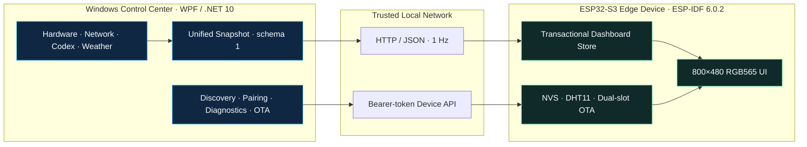

<p align="center">
  <a href="README.md">简体中文</a> · <strong>English</strong>
</p>

<div align="center">

<h1>Solis Monitor</h1>

<h3>From Windows telemetry to a reliable ESP32-S3 edge display.</h3>

<p><strong>A production-minded IoT system that connects desktop data collection, device provisioning, authenticated control, fault recovery and rollback-safe OTA delivery.</strong></p>

<p>
  <a href="https://github.com/Solismuchengxue/Solis_Monitor/releases/tag/v0.9.6-beta.5"></a>
  <a href="LICENSE"></a>
  
  
  
</p>

<p>
  <a href="https://github.com/Solismuchengxue/Solis_Monitor/releases/tag/v0.9.6-beta.5">Download Beta 5</a> ·
  <a href="DESIGN.md">Architecture</a> ·
  <a href="docs/PROTOCOL.md">Protocol</a> ·
  <a href="docs/TESTING.md">Verification</a>
</p>

</div>

<p align="center">
  
</p>

## Project Brief

Solis Monitor turns heterogeneous PC, network, Codex and weather data into a stable one-second telemetry stream for an 800×480 ESP32-S3 display. A native Windows control center owns collection, provisioning, pairing, diagnostics and firmware delivery; the edge device owns local rendering, environment sensing and recovery behavior.

| Area | Verifiable outcome |
| --- | --- |
| **Integrated product** | Native WPF control center + ESP32-S3 firmware + 3.97-inch physical display |
| **Cross-runtime contract** | Versioned schema 1 over HTTP/JSON, shared fixtures and transactional snapshot updates |
| **Device lifecycle** | AP provisioning, LAN discovery, six-digit pairing, token rotation, remote control and local OTA |
| **Operational resilience** | Last-known-good snapshots, isolated collectors, bounded redacted logs and automatic recovery |
| **Delivery** | Windows installer, portable package, firmware image and SHA-256 manifest |
| **Verification** | 128 desktop smoke tests + 78 firmware unit tests + 20 Python checks = **226 checks** |

## Forward-Deployed Engineering in Practice

This repository is more than a UI demo. It shows how an ambiguous device idea was translated into explicit constraints, integrated across software and hardware boundaries, hardened against real failure modes and packaged for repeatable delivery.

| Delivery stage | Engineering evidence |
| --- | --- |
| **Discover & scope** | Defined the 800×480 information hierarchy, one-device operating model, trusted-LAN boundary and explicit non-goals in the [requirements](docs/REQUIREMENTS.md) and [design](DESIGN.md). |
| **Design the system** | Split responsibilities between the Windows data authority and the edge renderer; established a versioned [HTTP/JSON contract](docs/PROTOCOL.md) with shared fixtures. |
| **Build across boundaries** | Integrated C#/.NET 10, WPF, Libre Hardware Monitor, ESP-IDF/C, NVS, Wi-Fi provisioning, local sensors and a custom RGB565 UI. |
| **Harden operations** | Preserved last valid state during partial failures, isolated background collectors, bounded diagnostic logs and protected OTA with validation and rollback. |
| **Deploy & validate** | Produced installer and portable artifacts, firmware and checksums; verified automated suites, physical hardware, upgrades and Windows DPI behavior. |

## End-to-End Architecture



The PC is the source of truth for remote telemetry and device management. The ESP32-S3 pulls a complete snapshot once per second and updates the dashboard only after the payload passes validation. After five seconds without valid data, it marks the PC link offline while retaining the last complete readings.

## Engineering Highlights

### One contract across two runtimes

- A single schema describes system, Codex and environment metrics across C# and C.
- Shared fixtures protect serialization, parsing, optional fields and availability semantics.
- Snapshot-level publication prevents partially collected data from leaking to the screen.

### Provisioning without exposing secrets

- The device provides a captive AP portal for first-time Wi-Fi setup.
- Physical interaction opens discovery; a rotating six-digit code completes pairing.
- Bearer tokens are generated and synchronized internally instead of being exposed in the normal UI.
- Credentials, API keys and complete tokens are excluded from diagnostics and runtime logs.

### Upgradeable edge deployment

- The desktop validates chip type, project name, version, image integrity and slot capacity before upload.
- Firmware streams the image into the inactive OTA slot and aborts cleanly on interruption.
- A newly booted image must confirm healthy operation; otherwise the ESP-IDF bootloader rolls back.

### Failure isolation and recovery

- Metrics and weather collectors fail independently and retry on their existing schedules.
- Failed cycles preserve the last complete values instead of publishing half-valid snapshots.
- Redacted runtime errors are rate-limited and rotated within an approximately 1 MiB total bound.
- Network, weather and sensor failures do not collapse unrelated parts of the system.

## Product Gallery

### ESP32-S3 edge display

| PC telemetry | Codex and environment |
| :---: | :---: |
|  |  |

### Windows control center

| Device lifecycle | Service observability | Firmware delivery |
| :---: | :---: | :---: |
|  |  |  |

## Evidence, Not Claims

| Evidence | What it protects |
| --- | --- |
| **128 desktop smoke tests** | Startup, metrics, Codex parsing, device API, pairing, diagnostics, notifications, OTA validation and background-failure recovery |
| **78 ESP-IDF unit tests** | Protocol parsing, provisioning, configuration, device control, environment sensing, UI state and OTA behavior |
| **20 Python checks** | Reproducible assets, generated resources, repository structure and firmware-size constraints |
| **Physical-device acceptance** | ESP32-S3 boot, 800×480 rendering, LAN reconnect, local sensor input, OTA and rollback behavior |
| **Windows delivery acceptance** | Installer upgrade, portable launch, runtime prerequisites and 100% / 125% / 150% DPI coverage |

The complete commands, current boundaries and hands-on procedures are documented in [Testing & Acceptance](docs/TESTING.md). Historical assertions are not promoted into current proof without source, automated-test or physical-device evidence.

## Download & Run

The current GitHub Latest release is [Solis Monitor v0.9.6 Beta 5](https://github.com/Solismuchengxue/Solis_Monitor/releases/tag/v0.9.6-beta.5), containing Windows desktop version `0.9.6` and ESP32-S3 firmware version `0.1.5`.

| Artifact | Purpose |
| --- | --- |
| [Windows x64 installer](https://github.com/Solismuchengxue/Solis_Monitor/releases/download/v0.9.6-beta.5/SolisMonitor-0.9.6-win-x64-setup.exe) | Standard installation, Start menu entry and optional desktop shortcut |
| [Windows x64 portable package](https://github.com/Solismuchengxue/Solis_Monitor/releases/download/v0.9.6-beta.5/SolisMonitor-0.9.6-win-x64-portable.zip) | Extract and run `SolisMonitor/SolisMonitor.exe` |
| [ESP32-S3 OTA firmware](https://github.com/Solismuchengxue/Solis_Monitor/releases/download/v0.9.6-beta.5/solis_monitor-0.1.5-esp32s3.bin) | LAN upgrade for devices already migrated to the dual-OTA layout |
| [SHA-256 manifest](https://github.com/Solismuchengxue/Solis_Monitor/releases/download/v0.9.6-beta.5/SHA256SUMS.txt) | Download-integrity verification |

Windows requires x64 Windows 10 version 1809 or later and the [.NET 10 Desktop Runtime](https://dotnet.microsoft.com/en-us/download/dotnet/10.0). Native notifications additionally use [Windows App Runtime 2.3.1](https://learn.microsoft.com/en-us/windows/apps/windows-app-sdk/downloads). Administrator privileges are recommended for complete hardware-sensor access.

### First-device workflow

1. Install or extract the Windows control center and start Solis Monitor.
2. Connect a phone to the device hotspot `Solis-Monitor-xxxx`, then open `http://192.168.0.1/` to configure Wi-Fi.
3. Double-click GPIO21 to enable discovery and enter the rotating six-digit pairing code in the desktop wizard.
4. After pairing, manage display behavior, diagnostics and local firmware OTA from the Windows application.

Detailed recovery and provisioning behavior is documented in [Provisioning & Pairing](docs/PROVISIONING.md).

## Technology & Repository

| Layer | Technology | Responsibility |
| --- | --- | --- |
| Windows application | C# · .NET 10 · WPF · Libre Hardware Monitor | Collection, control center, API, diagnostics and release packaging |
| Device firmware | C · ESP-IDF 6.0.2 · FreeRTOS · NVS | Connectivity, protocol, control, OTA, display and local sensing |
| Integration | HTTP/1.1 · JSON · Bearer token · shared fixtures | Versioned telemetry and device-management contracts |
| Verification | .NET smoke runner · Unity · Python · PowerShell | Cross-boundary regression and release gates |

<details>
<summary><strong>Repository map</strong></summary>

| Path | Responsibility |
| --- | --- |
| `app/LibreHardwareMonitor/` | Windows control center, collection, device API and release input |
| `firmware/main/` | ESP32-S3 entry point and main loop |
| `firmware/components/` | Network, protocol, control, OTA, display, UI and board modules |
| `firmware/test_apps/unit/` | ESP-IDF unit-test application |
| `app/tests/`, `tools/` | Desktop smoke tests, resource checks and unified verification |
| `reference/` | Schematics, pins, hardware parameters and display resources |
| `docs/` | Requirements, architecture decisions, protocol, operations and acceptance evidence |

</details>

<details>
<summary><strong>Build and verify</strong></summary>

With .NET 10, Python 3.12 and ESP-IDF 6.0.2 available:

```powershell
pwsh -NoProfile -File .\tools\verify.ps1
```

The script restores, tests and builds the Windows solution, runs Python checks, builds firmware with an isolated configuration and verifies that the image fits either `0x3E0000` OTA slot. It does not flash hardware or change the Windows firewall.

</details>

## Documentation

[Requirements](docs/REQUIREMENTS.md) · [Architecture](DESIGN.md) · [Decisions](docs/DECISIONS.md) · [Desktop](docs/DESKTOP_APP.md) · [Firmware](docs/FIRMWARE.md) · [Protocol](docs/PROTOCOL.md) · [Provisioning](docs/PROVISIONING.md) · [Testing](docs/TESTING.md)

## Engineering Boundaries

- PC-to-device traffic currently uses HTTP and must remain inside a trusted local network; it is not designed for direct internet exposure.
- Release executables are not code-signed, so Windows may display an unknown-publisher warning.
- Devices still using the legacy single `factory` partition require one full serial flash before normal dual-slot OTA updates.
- Solis Monitor is a personal engineering project and reference implementation; this README does not claim a commercial customer deployment.

These boundaries are intentional and documented because sound delivery includes knowing what a system does **not** guarantee.

## License

Original repository content is released under the [Mozilla Public License 2.0](LICENSE). Source derived from Libre Hardware Monitor remains subject to MPL-2.0; third-party components and assets retain their respective licenses and notices, including `app/LibreHardwareMonitor/THIRD-PARTY-NOTICES.txt`.

---

<div align="center">
  <strong>Designed across desktop, protocol, firmware and physical-device boundaries.</strong>
</div>
