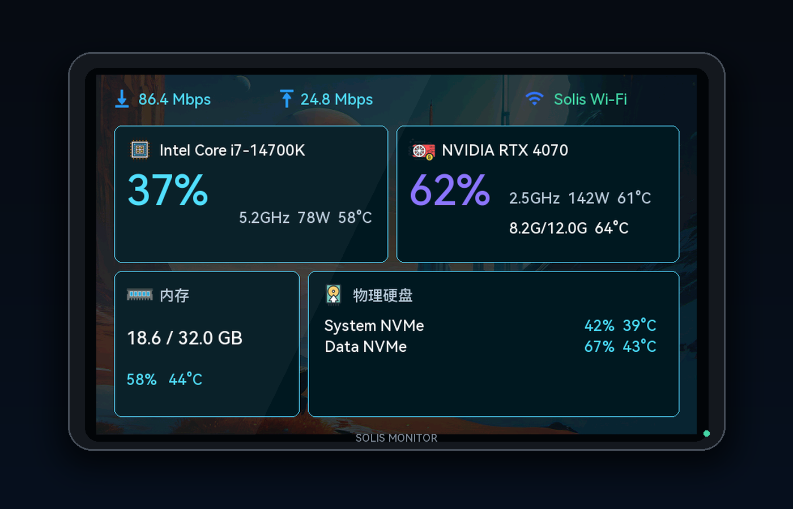
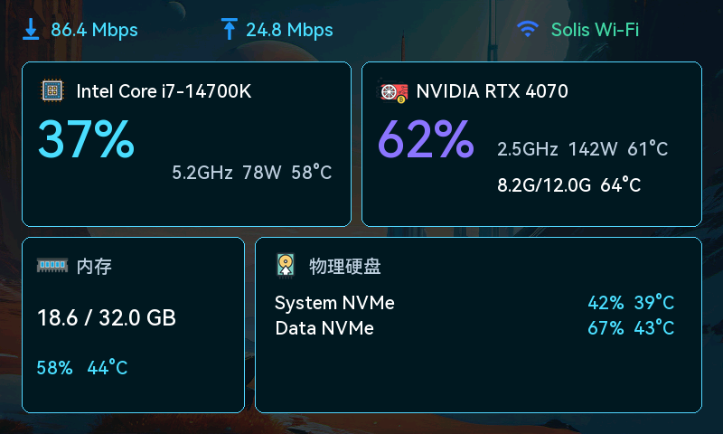
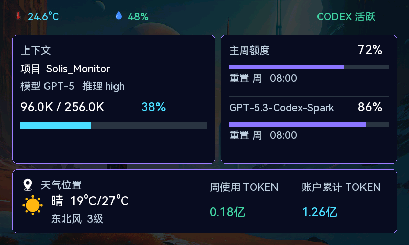
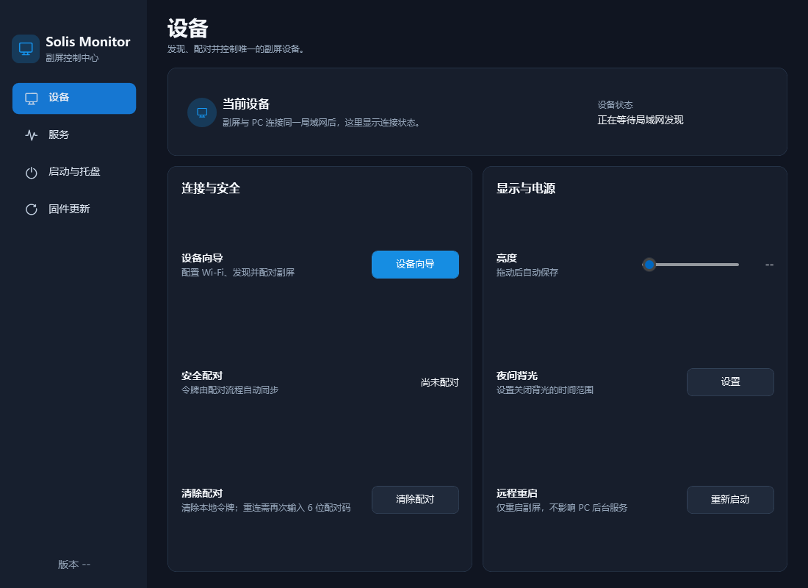
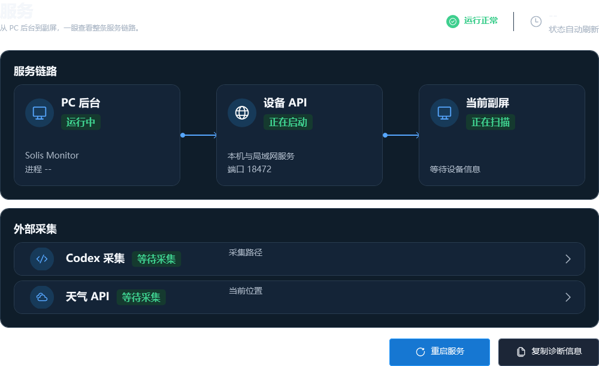
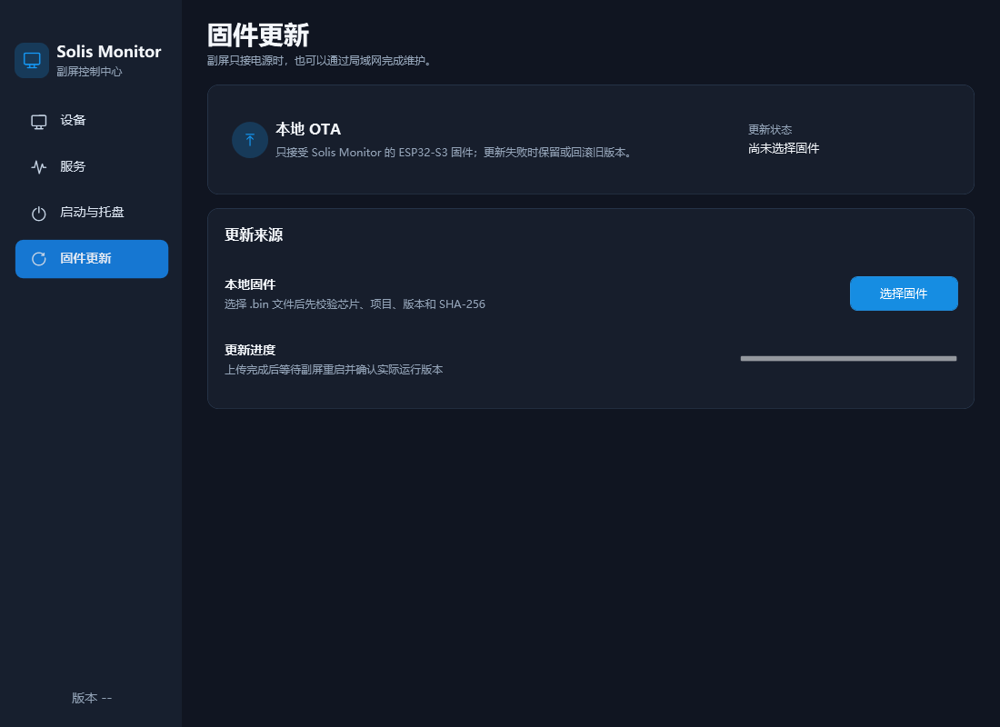
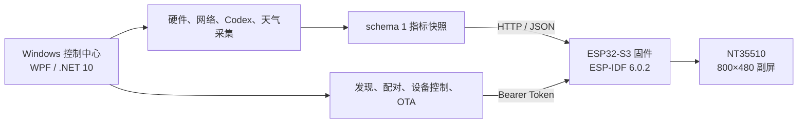

# Solis Monitor

Solis Monitor 是一套由 Windows 桌面控制中心与 ESP32-S3 副屏组成的端到端 IoT 监控和设备管理系统。它统一采集电脑硬件、网络、Codex 使用情况、天气与本地环境数据，并将实时状态呈现在 NT35510 3.97 英寸 800×480 屏幕上。

项目覆盖需求、架构、跨端协议、设备配网与配对、安全控制、双分区 OTA、自动化测试和运维文档，形成从方案设计、软件实现到发布交付的完整工程闭环。

[下载 v0.9.6 Beta 4](https://github.com/Solismuchengxue/Solis_Monitor/releases/tag/v0.9.6-beta.4) · [总体设计](DESIGN.md) · [通信协议](docs/PROTOCOL.md) · [测试说明](docs/TESTING.md) · [MPL-2.0 许可证](LICENSE)

> **技术栈：** C# / .NET 10 / WPF · Libre Hardware Monitor · ESP-IDF 6.0.2 / C · ESP32-S3 · HTTP / JSON · NVS · 双分区 OTA

## 效果预览

### ESP32-S3 副屏



| 电脑传感器页 | Codex 与环境页 |
| :---: | :---: |
|  |  |

### Windows 控制中心

| 设备管理 | 服务链路 | 固件更新 |
| :---: | :---: | :---: |
|  |  |  |

## 工程亮点

- **端到端方案与交付**：从[需求基线](docs/REQUIREMENTS.md)、[总体设计](DESIGN.md)和[架构决策](docs/DECISIONS.md)出发，协同落地 Windows 应用、嵌入式固件、设备接口、部署与验收资料。
- **跨端系统集成**：Windows 端统一采集 CPU、GPU、内存、存储、网络、Codex 和天气指标，通过 schema 1 HTTP/JSON 协议发布完整快照；ESP32-S3 每秒拉取并事务性更新界面，异常数据不会覆盖最后有效状态。
- **设备全生命周期管理**：实现 AP Web 配网、局域网发现、6 位码配对、Bearer Token 鉴权、亮度与夜间计划、远程诊断，以及带镜像校验、双槽切换和失败回滚的局域网 OTA。
- **后台可靠性与可诊断性**：隔离指标与天气采集中的可恢复异常，失败周期保留最后完整快照；运行时错误日志采用脱敏字段、五分钟限流和 512 KiB 有界轮换。
- **可验证、可维护**：128 项桌面端冒烟测试、78 项固件单元测试和 20 项 Python 工具测试覆盖核心链路，并由 `tools/verify.ps1` 提供统一检查入口。

## 系统架构



PC 端是指标与设备管理的数据权威，副屏负责按秒拉取快照并渲染。设备连续 5 秒没有收到有效数据时会进入离线状态，同时保留最后一次有效读数。PC 与 ESP32 当前使用 HTTP，因此只应部署在可信局域网中。

## 核心能力

| 领域 | 能力 |
| --- | --- |
| 电脑监控 | CPU、GPU/显存、内存、物理硬盘、FPS、出口网速与实时传感器 |
| Codex 指标 | 最后活动项目与任务、模型、推理强度、上下文、累计 Token 和周额度 |
| 环境信息 | 和风天气、本地温湿度、网络状态与失败回退 |
| 设备管理 | AP Web 配网、自动发现、6 位码配对、令牌轮换、亮度和夜间计划 |
| 固件维护 | 本地镜像检查、局域网 OTA、双应用槽、启动确认与失败回滚 |
| Windows 体验 | 原生 WPF 控制中心、托盘运行、开机启动、诊断与原生通知 |

## 下载与运行

当前 GitHub Latest 版本为 [Solis Monitor v0.9.6 Beta 4](https://github.com/Solismuchengxue/Solis_Monitor/releases/tag/v0.9.6-beta.4)，包含 Windows 桌面端 `0.9.6` 和 ESP32-S3 固件 `0.1.5`。

| 文件 | 用途 |
| --- | --- |
| [Windows x64 安装包](https://github.com/Solismuchengxue/Solis_Monitor/releases/download/v0.9.6-beta.4/SolisMonitor-0.9.6-win-x64-setup.exe) | 标准安装、开始菜单入口和可选桌面快捷方式 |
| [Windows x64 便携版](https://github.com/Solismuchengxue/Solis_Monitor/releases/download/v0.9.6-beta.4/SolisMonitor-0.9.6-win-x64-portable.zip) | 解压后运行 `SolisMonitor/SolisMonitor.exe` |
| [ESP32-S3 OTA 固件](https://github.com/Solismuchengxue/Solis_Monitor/releases/download/v0.9.6-beta.4/solis_monitor-0.1.5-esp32s3.bin) | 已完成双 OTA 分区迁移设备的局域网升级 |
| [SHA-256 校验清单](https://github.com/Solismuchengxue/Solis_Monitor/releases/download/v0.9.6-beta.4/SHA256SUMS.txt) | 校验下载文件完整性 |

Windows 端支持 Windows 10 1809 或更高版本的 x64 系统，需要 [.NET 10 Desktop Runtime x64](https://dotnet.microsoft.com/en-us/download/dotnet/10.0)；原生通知功能需要 [Windows App Runtime 2.3.1 x64](https://learn.microsoft.com/en-us/windows/apps/windows-app-sdk/downloads)。硬件传感器采集建议以管理员权限运行。

当前安装包和主程序尚未数字签名，Windows 可能显示“未知发布者”。首次从旧单 `factory` 分区迁移的设备不能只上传 OTA 文件，仍需按[固件文档](docs/FIRMWARE.md)完成一次完整串口烧录。

## 使用流程

1. 安装或解压 Windows 桌面端，并以管理员权限启动 Solis Monitor。
2. 全新设备启动后会开放 `Solis-Monitor-xxxx` 热点；手机连接后访问 `http://192.168.0.1/` 完成 Wi-Fi 配置。
3. 设备联网后双击 GPIO21 开启发现，在桌面端设备向导中输入副屏显示的 6 位配对码。
4. 配对成功后，副屏开始按秒刷新指标；后续可在桌面端调整显示、电源与天气设置，并通过“固件更新”页执行局域网 OTA。

设备令牌由桌面端生成并自动同步，不需要用户查看或手工输入。详细操作及救援入口见[配网与配对文档](docs/PROVISIONING.md)。

## 项目结构

| 路径 | 职责 |
| --- | --- |
| `app/LibreHardwareMonitor/` | Windows 控制中心、硬件采集、设备 API、通知与安装发布输入 |
| `firmware/main/` | ESP32-S3 启动入口和主循环 |
| `firmware/components/` | 网络、协议、设备控制、OTA、显示、UI 与板级模块 |
| `firmware/test_apps/unit/` | 固件单元测试工程 |
| `tools/`、`app/tests/` | 资源生成、结构检查和桌面端冒烟测试 |
| `reference/` | 原理图、引脚、硬件参数与显示素材 |
| `docs/` | 需求、协议、配网、测试、桌面端、固件和运维文档 |

## 构建与验证

在 .NET 10、Python 3.12 和 ESP-IDF 6.0.2 环境中运行统一验证：

```powershell
pwsh -NoProfile -File .\tools\verify.ps1
```

脚本会还原、测试并构建 Windows 解决方案，运行 Python 检查，并使用独立配置构建固件和报告镜像大小；它不会刷写设备或修改 Windows 防火墙。正式固件必须能够装入任一 `0x3E0000` OTA 分区。

更具体的入口：

- [Windows 桌面端构建、配置与发布](docs/DESKTOP_APP.md)
- [ESP32-S3 固件构建、分区与烧录](docs/FIRMWARE.md)
- [通信协议与认证边界](docs/PROTOCOL.md)
- [完整测试和实机验收](docs/TESTING.md)

## 文档导航

| 文档 | 内容 |
| --- | --- |
| [需求基线](docs/REQUIREMENTS.md) | 范围、角色、功能与非功能需求 |
| [总体设计](DESIGN.md) | 系统架构、数据流与关键约束 |
| [架构决策](docs/DECISIONS.md) | 已采用方案、未采用方案和复审条件 |
| [Windows 桌面端](docs/DESKTOP_APP.md) | 控制中心、设备 API、安装与通知 |
| [固件](docs/FIRMWARE.md) | 硬件目标、构建、分区和 OTA |
| [配网与配对](docs/PROVISIONING.md) | AP Portal、发现、配对和救援入口 |
| [Codex 指标](docs/CODEX_METRICS.md) | 本地任务解析、额度与脱敏边界 |
| [天气](docs/WEATHER.md) | 本地密钥、采集、刷新和失败回退 |
| [测试](docs/TESTING.md) | 自动化检查、实机验证和发布门禁 |

## 许可证

本仓库原创内容采用 [Mozilla Public License 2.0](LICENSE) 发布。`app/LibreHardwareMonitor/` 中基于 Libre Hardware Monitor 的源码继续受 MPL-2.0 约束；第三方组件与素材保留各自的许可证和版权声明，详见对应目录中的许可证文件及 `app/LibreHardwareMonitor/THIRD-PARTY-NOTICES.txt`。
