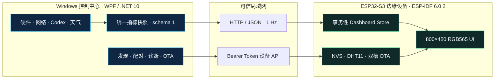

<p align="center">
  <strong>简体中文</strong> · <a href="README.en.md">English</a>
</p>

<div align="center">

<h1>Solis Monitor</h1>

<h3>从 Windows 遥测到可靠的 ESP32-S3 边缘副屏</h3>

<p><strong>一套面向真实交付的 IoT 系统，贯通桌面数据采集、设备配网、鉴权控制、故障恢复与可回滚 OTA。</strong></p>

<p>
  <a href="https://github.com/Solismuchengxue/Solis_Monitor/releases/tag/v0.9.6-beta.5"></a>
  <a href="LICENSE"></a>
  
  
  
</p>

<p>
  <a href="https://github.com/Solismuchengxue/Solis_Monitor/releases/tag/v0.9.6-beta.5">下载 Beta 5</a> ·
  <a href="DESIGN.md">总体设计</a> ·
  <a href="docs/PROTOCOL.md">通信协议</a> ·
  <a href="docs/TESTING.md">测试验证</a>
</p>

</div>

<p align="center">
  
</p>

## 项目概览

Solis Monitor 将电脑硬件、网络、Codex 和天气等异构数据统一为每秒更新的指标快照，并呈现在 800×480 的 ESP32-S3 副屏上。原生 Windows 控制中心负责采集、配网、配对、诊断与固件交付，边缘设备负责本地渲染、环境采集和故障恢复。

| 领域 | 可验证成果 |
| --- | --- |
| **完整产品** | 原生 WPF 控制中心 + ESP32-S3 固件 + 3.97 英寸实体副屏 |
| **跨运行时协议** | 基于 HTTP/JSON 的版本化 schema 1、共享夹具与事务性快照更新 |
| **设备生命周期** | AP 配网、局域网发现、六位码配对、令牌轮换、远程控制与本地 OTA |
| **运行可靠性** | 最后有效快照、采集故障隔离、有界脱敏日志与自动恢复 |
| **发布交付** | Windows 安装包、便携包、固件镜像与 SHA-256 校验清单 |
| **自动化验证** | 128 项桌面冒烟测试 + 78 项固件单元测试 + 20 项 Python 检查 = **226 项检查** |

## 面向现场的工程交付

本仓库不只是一个界面演示，而是一份把模糊设备构想转化为明确约束、跨软硬件集成、真实故障加固并形成可重复交付物的完整工程案例。

| 交付阶段 | 工程证据 |
| --- | --- |
| **需求澄清与范围界定** | 在[需求基线](docs/REQUIREMENTS.md)和[总体设计](DESIGN.md)中明确 800×480 信息层级、单设备运行模型、可信局域网边界与非目标。 |
| **系统方案设计** | 划分 Windows 数据权威与边缘渲染职责，通过共享夹具建立版本化 [HTTP/JSON 协议](docs/PROTOCOL.md)。 |
| **跨边界实现** | 集成 C#/.NET 10、WPF、Libre Hardware Monitor、ESP-IDF/C、NVS、Wi-Fi 配网、本地传感器与自绘 RGB565 界面。 |
| **运行可靠性加固** | 在部分故障中保留最后有效状态，隔离后台采集器，限制诊断日志，并通过校验与回滚保护 OTA。 |
| **部署与验收** | 产出安装包、便携包、固件和校验清单，验证自动化测试、实体设备、覆盖升级与 Windows DPI 行为。 |

## 端到端架构



PC 端是远程指标和设备管理的数据权威。ESP32-S3 每秒拉取一次完整快照，只有载荷通过校验后才更新界面。连续五秒没有有效数据时，设备会将 PC 链路标记为离线，同时保留最后一次完整读数。

## 核心工程能力

### 一份协议贯通两个运行时

- 统一 schema 同时描述 C# 与 C 侧的系统、Codex 和环境指标。
- 共享夹具保护序列化、解析、可选字段与可用性语义。
- 按快照整体发布，防止未完成采集的数据泄漏到副屏。

### 不暴露敏感信息的设备配网

- 设备通过 AP 门户完成首次 Wi-Fi 配置。
- 用户执行实体按键操作后才开放发现，并通过定时轮换的六位码完成配对。
- Bearer Token 由系统内部生成和同步，不在普通界面中暴露。
- 诊断信息和运行日志不记录凭据、API Key 或完整设备令牌。

### 可持续升级的边缘设备

- 桌面端在上传前校验芯片、项目名、版本、镜像完整性与槽位容量。
- 固件把镜像流式写入非运行 OTA 槽，传输中断时安全终止。
- 新镜像启动后必须确认运行健康，否则由 ESP-IDF Bootloader 自动回滚。

### 故障隔离与自动恢复

- 指标和天气采集器独立失败，并按既有周期继续重试。
- 失败周期保留最后一次完整值，不发布半有效快照。
- 脱敏运行时错误受到频率限制和轮换保护，总占用约束在 1 MiB 左右。
- 网络、天气和传感器故障不会拖垮无关模块。

## 产品效果

### ESP32-S3 副屏

| 电脑状态 | Codex 与环境 |
| :---: | :---: |
|  |  |

### Windows 控制中心

| 设备生命周期 | 服务可观测性 | 固件交付 |
| :---: | :---: | :---: |
|  |  |  |

## 可核验工程证据

| 证据 | 覆盖范围 |
| --- | --- |
| **128 项桌面冒烟测试** | 启动、指标、Codex 解析、设备 API、配对、诊断、通知、OTA 校验和后台故障恢复 |
| **78 项 ESP-IDF 单元测试** | 协议解析、配网、配置、设备控制、环境采集、UI 状态和 OTA 行为 |
| **20 项 Python 检查** | 可重复资源、生成文件、仓库结构和固件容量约束 |
| **实体设备验收** | ESP32-S3 启动、800×480 渲染、局域网重连、本地传感器、OTA 和回滚行为 |
| **Windows 交付验收** | 安装器覆盖升级、便携版启动、运行时依赖与 100% / 125% / 150% DPI 覆盖 |

完整命令、当前验证边界和实机步骤见[测试与验收文档](docs/TESTING.md)。没有源码、自动化测试或实体设备证据支撑的历史结论，不会被包装成当前能力。

## 下载运行

当前 GitHub Latest 版本为 [Solis Monitor v0.9.6 Beta 5](https://github.com/Solismuchengxue/Solis_Monitor/releases/tag/v0.9.6-beta.5)，包含 Windows 桌面端 `0.9.6` 和 ESP32-S3 固件 `0.1.5`。

| 文件 | 用途 |
| --- | --- |
| [Windows x64 安装包](https://github.com/Solismuchengxue/Solis_Monitor/releases/download/v0.9.6-beta.5/SolisMonitor-0.9.6-win-x64-setup.exe) | 标准安装、开始菜单入口和可选桌面快捷方式 |
| [Windows x64 便携包](https://github.com/Solismuchengxue/Solis_Monitor/releases/download/v0.9.6-beta.5/SolisMonitor-0.9.6-win-x64-portable.zip) | 解压后运行 `SolisMonitor/SolisMonitor.exe` |
| [ESP32-S3 OTA 固件](https://github.com/Solismuchengxue/Solis_Monitor/releases/download/v0.9.6-beta.5/solis_monitor-0.1.5-esp32s3.bin) | 已迁移至双 OTA 分区设备的局域网升级 |
| [SHA-256 校验清单](https://github.com/Solismuchengxue/Solis_Monitor/releases/download/v0.9.6-beta.5/SHA256SUMS.txt) | 校验下载文件完整性 |

Windows 端需要 x64 Windows 10 1809 或更高版本，以及 [.NET 10 Desktop Runtime](https://dotnet.microsoft.com/en-us/download/dotnet/10.0)。原生通知还会使用 [Windows App Runtime 2.3.1](https://learn.microsoft.com/en-us/windows/apps/windows-app-sdk/downloads)。完整访问硬件传感器时建议使用管理员权限。

### 首次接入流程

1. 安装或解压 Windows 控制中心，然后启动 Solis Monitor。
2. 手机连接设备热点 `Solis-Monitor-xxxx`，访问 `http://192.168.0.1/` 配置 Wi-Fi。
3. 双击 GPIO21 开启发现，在桌面向导中输入定时轮换的六位配对码。
4. 配对后，通过 Windows 应用管理显示行为、诊断和本地固件 OTA。

详细恢复和配网行为见[配网与配对文档](docs/PROVISIONING.md)。

## 技术与仓库

| 层级 | 技术 | 职责 |
| --- | --- | --- |
| Windows 应用 | C# · .NET 10 · WPF · Libre Hardware Monitor | 数据采集、控制中心、API、诊断与发布打包 |
| 设备固件 | C · ESP-IDF 6.0.2 · FreeRTOS · NVS | 网络、协议、控制、OTA、显示与本地传感 |
| 系统集成 | HTTP/1.1 · JSON · Bearer Token · 共享夹具 | 版本化指标与设备管理协议 |
| 验证体系 | .NET 冒烟运行器 · Unity · Python · PowerShell | 跨边界回归与发布门禁 |

<details>
<summary><strong>仓库结构</strong></summary>

| 路径 | 职责 |
| --- | --- |
| `app/LibreHardwareMonitor/` | Windows 控制中心、采集、设备 API 与发布输入 |
| `firmware/main/` | ESP32-S3 入口与主循环 |
| `firmware/components/` | 网络、协议、控制、OTA、显示、UI 与板级模块 |
| `firmware/test_apps/unit/` | ESP-IDF 单元测试应用 |
| `app/tests/`、`tools/` | 桌面冒烟测试、资源检查和统一验证 |
| `reference/` | 原理图、引脚、硬件参数与显示资源 |
| `docs/` | 需求、架构决策、协议、运维和验收证据 |

</details>

<details>
<summary><strong>构建与验证</strong></summary>

准备 .NET 10、Python 3.12 和 ESP-IDF 6.0.2 后执行：

```powershell
pwsh -NoProfile -File .\tools\verify.ps1
```

脚本会还原、测试并构建 Windows 解决方案，运行 Python 检查，使用独立配置构建固件，并验证镜像能够装入任一 `0x3E0000` OTA 槽。它不会刷写硬件或修改 Windows 防火墙。

</details>

## 文档导航

[需求基线](docs/REQUIREMENTS.md) · [总体设计](DESIGN.md) · [架构决策](docs/DECISIONS.md) · [桌面端](docs/DESKTOP_APP.md) · [固件](docs/FIRMWARE.md) · [通信协议](docs/PROTOCOL.md) · [配网与配对](docs/PROVISIONING.md) · [测试](docs/TESTING.md)

## 工程边界

- PC 与设备当前使用 HTTP 通信，必须部署在可信局域网内，不适合直接暴露到互联网。
- 发布程序尚未进行代码签名，Windows 可能显示未知发布者警告。
- 仍使用旧单 `factory` 分区的设备，需要先完成一次完整串口烧录，之后才能使用双槽 OTA。
- Solis Monitor 是个人工程项目和参考实现；本文不声称已经完成商业客户生产部署。

这些边界是有意保留并明确记录的，因为可靠交付也包括准确说明系统不保证什么。

## 许可证

本仓库原创内容采用 [Mozilla Public License 2.0](LICENSE) 发布。基于 Libre Hardware Monitor 的源码继续受 MPL-2.0 约束；第三方组件和素材保留各自的许可证与声明，包括 `app/LibreHardwareMonitor/THIRD-PARTY-NOTICES.txt`。

---

<div align="center">
  <strong>跨越桌面、协议、固件与实体设备边界完成设计和交付。</strong>
</div>
