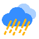
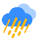
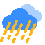
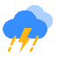
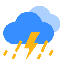

# 和风天气图标映射

> 核对日期：2026-07-25
> 官方清单：[和风天气图标说明](https://dev.qweather.com/docs/resource/icons/)

和风天气当前列出 62 个天气代码。Solis Monitor 天气素材为
`reference/assets/m00.png`～`m26.png`，共 27 张。原有 `m00`～`m17`
覆盖白天晴、多云、雨和雪；新增 `m18`～`m26` 补齐夜间和特殊天气。
桌面端先把和风天气代码映射为 0～26，再由固件绘制对应的 `mXX`。

状态含义：

- **已有**：有含义基本一致的素材。
- **新增**：按原有 65×65 扁平彩色风格生成的新素材。
- **复用**：多个强度或过渡天气共用一张近似素材。
- **复用现有**：夜间天气本身不含日月元素，可以安全复用原素材。

## 现有素材预览

| 素材 | 图标 | 当前含义 | 素材 | 图标 | 当前含义 |
| --- | --- | --- | --- | --- | --- |
| `m00` |  | 晴 | `m09` |  | 大雨 |
| `m01` |  | 多云 | `m10` |  | 暴雨 |
| `m02` |  | 阴 | `m11` |  | 大暴雨 |
| `m03` |  | 阵雨 | `m12` |  | 特大暴雨 |
| `m04` |  | 雷阵雨 | `m13` |  | 阵雪 |
| `m05` |  | 强雷阵雨 | `m14` |  | 小雪 |
| `m06` |  | 雨夹雪 | `m15` |  | 中雪 |
| `m07` |  | 小雨 | `m16` |  | 大雪 |
| `m08` |  | 中雨 | `m17` |  | 暴雪 |

### 新增素材

| 素材 | 图标 | 当前含义 | 素材 | 图标 | 当前含义 |
| --- | --- | --- | --- | --- | --- |
| `m18` |  | 夜间晴 | `m23` |  | 沙尘 |
| `m19` |  | 夜间多云 | `m24` |  | 热 |
| `m20` |  | 夜间阵雨 | `m25` |  | 冷 |
| `m21` |  | 雾 | `m26` |  | 未知 |
| `m22` |  | 霾 |  |  |  |

## 和风代码对应表

| 和风代码 | 官方天气 | 预览 | 当前素材 | 状态 | 说明 |
| --- | --- | --- | --- | --- | --- |
| 100 | 晴（白天） |  | `m00` | 已有 | 晴天 |
| 101、102、103 | 多云、少云、晴间多云（白天） |  | `m01` | 复用 | 三种云量共用 |
| 104 | 阴 |  | `m02` | 已有 | 阴或多云 |
| 150 | 晴（夜间） |  | `m18` | 新增 | 月亮 |
| 151、152、153 | 多云、少云、晴间多云（夜间） |  | `m19` | 新增/复用 | 三种夜间云量共用 |
| 300、301 | 阵雨、强阵雨（白天） |  | `m03` | 复用 | 强度未区分 |
| 302 | 雷阵雨 |  | `m04` | 已有 | 雷阵雨 |
| 303、304 | 强雷阵雨、雷阵雨伴冰雹 |  | `m05` | 复用 | 冰雹未单独区分 |
| 305、309、314 | 小雨、毛毛雨、小到中雨 |  | `m07` | 复用 | 小雨级 |
| 306、315、399 | 中雨、中到大雨、雨 |  | `m08` | 复用 | 中雨/普通雨 |
| 307、316 | 大雨、大到暴雨 |  | `m09` | 复用 | 大雨级 |
| 310、317 | 暴雨、暴雨到大暴雨 |  | `m10` | 复用 | 暴雨级 |
| 311 | 大暴雨 |  | `m11` | 已有 | 大暴雨 |
| 308、312、318 | 极端降雨、特大暴雨、大暴雨到特大暴雨 |  | `m12` | 复用 | 最高降雨等级 |
| 313、404、405、406 | 冻雨、雨夹雪、雨雪、阵雨夹雪（白天） |  | `m06` | 复用 | 冻雨和雨雪共用 |
| 350、351 | 阵雨、强阵雨（夜间） |  | `m20` | 新增/复用 | 两种强度共用 |
| 400、408 | 小雪、小到中雪 |  | `m14` | 复用 | 小雪级 |
| 401、409、499 | 中雪、中到大雪、雪 |  | `m15` | 复用 | 中雪/普通雪 |
| 402、410 | 大雪、大到暴雪 |  | `m16` | 复用 | 大雪级 |
| 403 | 暴雪 |  | `m17` | 已有 | 暴雪 |
| 407 | 阵雪（白天） |  | `m13` | 已有 | 阵雪 |
| 456 | 阵雨夹雪（夜间） |  | `m06` | 复用现有 | 原图不含太阳 |
| 457 | 阵雪（夜间） |  | `m13` | 复用现有 | 原图不含太阳 |
| 500、501、509、510、514、515 | 薄雾、雾、浓雾、强浓雾、大雾、特强浓雾 |  | `m21` | 新增/复用 | “雾”代码 501 现在有图标 |
| 502、511、512、513 | 霾、中度霾、重度霾、严重霾 |  | `m22` | 新增/复用 | 四种霾等级共用 |
| 503、504、507、508 | 扬沙、浮尘、沙尘暴、强沙尘暴 |  | `m23` | 新增/复用 | 四种沙尘等级共用 |
| 900 | 热 |  | `m24` | 新增 | 高温 |
| 901 | 冷 |  | `m25` | 新增 | 低温 |
| 999 | 未知 |  | `m26` | 新增 | 未知/占位 |

## 当前覆盖结论

- 官方天气代码：62 个。
- 已映射：62 个代码。
- 当前完全缺少：0 个代码。
- 新增素材：9 张；复用原有素材：2 类夜间雨雪天气。
- “雾”代码 `501` 映射到 `m21`。

## 素材来源与生成

- 优先评估了和风天气官方 SVG 图标，但官方图标为单色线性/填充风格，
  与项目现有彩色扁平图标不一致，因此没有混用。
- 没有找到来源和许可证均可确认、且与现有素材同系列的完整图包。
- `m18`～`m26` 由 `tools/Generate-WeatherIcons.ps1` 使用现有主色
  `#368EFF`、`#ADD1FF`、`#FFB615` 在 65×65 透明画布上生成。
- 固件最终使用 `tools/generate_assets.py` 统一缩放为 48×48 RGBA565。
